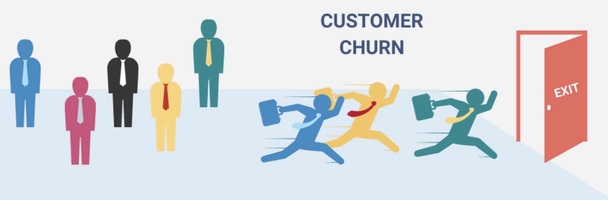

# Qu'est-ce que le "churn" client ?

Le "churn client", ou **désabonnement client**, est un terme crucial dans le monde des affaires. Il désigne le moment où un client **décide de cesser d'utiliser les services, le contenu ou les produits d'une entreprise**.

## Définition et Exemples
Plus précisément, l'attrition des clients est le **pourcentage de clients qui ont cessé d'utiliser le produit ou le service de votre organisation au cours d'une période donnée**.
Voici quelques exemples concrets de désabonnement client :
*   L'**annulation d'un service** sous contrat ou non.
*   Un client qui décide d'**acheter chez un concurrent** au lieu de l'entreprise.
*   Un utilisateur de site web qui se **désabonne d'une newsletter**.
*   Un titulaire de compte bancaire qui choisit de **clôturer son compte**.

## Calcul du Taux de Désabonnement
Le taux de désabonnement peut être calculé en divisant le nombre de clients perdus au cours d'une période par le nombre de clients que vous aviez au début de cette même période, puis en multipliant par 100.
**Formule : (nombre de clients perdus ÷ nombre total de clients au début de la période) x 100**.
Par exemple, si une entreprise commence le mois avec 1000 clients et le termine avec 900 clients, son taux d'attrition est de 10 %.
En règle générale, un taux de désabonnement annuel acceptable est de l'ordre de **5 à 7 % pour un produit livré en tant que service (SaaS)**, et de 2 à 3 % pour d'autres modèles de licence.

## Importance de la Fidélisation Client et de la Prédiction du Churn
Le taux de désabonnement est une mesure **extrêmement importante** que toute organisation devrait surveiller. C'est une "bouée de sauvetage" pour l'entreprise car **les revenus sont fournis par les clients**. Le taux de désabonnement est un "énorme tueur d’affaires", car même de **petites augmentations peuvent entraîner une réduction significative des revenus**.

La fidélisation d'un client est l'élément le plus crucial sur lequel toute organisation devrait se concentrer pour les raisons suivantes :
*   Il en coûte **jusqu'à 7 fois plus cher d'acquérir un nouveau client que de fidéliser un ancien**.
*   La **probabilité de vendre à un client existant est de 60 à 70 %**, tandis que pour un nouveau prospect, elle n'est que de 5 à 20 %.
*   Une augmentation de la fidélisation des clients de seulement **5 % peut augmenter les bénéfices de 25 à 95 %**.
*   **65 % de l'activité d'une entreprise provient de clients existants**.
*   Les **clients fidèles dépensent 67 % de plus** que les nouveaux clients.
*   Les clients existants sont **50 % plus susceptibles d'essayer de nouveaux produits et dépensent 31 % de plus** que les nouveaux clients.
*   **82 % des entreprises s'accordent à dire que la fidélisation des clients est moins chère que l'acquisition**.

Pour toutes ces raisons, la prédiction du taux de désabonnement est **cruciale pour toute entreprise**. Les entreprises préfèrent se concentrer sur la **fidélisation de leurs clients actuels**. En comprenant mieux le comportement de leurs clients, les entreprises peuvent les fidéliser. Une façon de le faire consiste à créer un modèle d'apprentissage automatique (Machine Learning) ou de réseaux de neurones artificiels qui peut **prédire les clients susceptibles de se désabonner**. Une fois ces clients à risque identifiés, l'entreprise peut les **cibler avec des campagnes marketing spécifiques et des offres intéressantes pour les retenir**, réduisant ainsi les coûts de rétention et évitant qu'ils ne partent chez les concurrents.

## Principales Raisons du Désabonnement Client
Il existe plusieurs raisons pour lesquelles l'attrition des clients se produit :
*   **Le prix et la valeur perçue** : Le prix est la principale raison, surtout lorsque les clients ne voient pas de valeur dans leurs investissements. Leurs offres peuvent ne pas répondre à leurs attentes ou aux fonctionnalités promises, ce qui les pousse à ne plus trouver de valeur dans le produit ou service.
*   **Problèmes de produit ou service** : Le produit ou service peut ne pas faciliter la vie du client. Il peut être difficile à utiliser, nécessitant un support constant, ou présenter des bogues, des problèmes ou des temps d'arrêt, rendant difficile la poursuite de leur activité.
*   **Qualité du service client et support inadéquat** : Un service qui n'est pas à la hauteur, un système de billetterie complexe, un support client inadéquat, ou l'impression de ne pas être le client le plus précieux (manque de priorité ou d'accès à la haute direction) peuvent entraîner le départ des clients.
*   **Concurrence** : Les clients peuvent se désabonner parce que les concurrents sous-cotent les prix ou offrent une meilleure valeur.
*   **Décisions internes et contrats** : Parfois, des décisions de politique interne ou des contrats mondiaux signés avec un autre fournisseur peuvent faire partir les clients.
*   **Évolution des besoins** : Les clients peuvent avoir l'impression qu'ils n'ont plus besoin du produit. De plus, l'évolution des besoins, la confusion concernant de nouvelles fonctionnalités et les mises à jour des produits peuvent éloigner les clients si l'entreprise cesse de les aider dans leur cycle de vie.
*   **Difficulté à faire affaire avec l'entreprise** : S'il est difficile de mettre à niveau les versions des produits, d'appliquer des correctifs, de retourner ou commander de nouveaux produits, ou de demander un service, le taux d'attrition peut augmenter.
*   **Mauvaise adéquation client-produit** : Parfois, le client n'est tout simplement pas le bon pour le segment cible de l'entreprise. Il peut être acceptable de laisser de tels clients se désabonner. Il est important de comprendre les besoins du client pour assurer l'adéquation produit-marché.
*   **Méthodes de paiement expirées** : Le moyen de paiement des clients peut avoir expiré, ce qui entraîne un désabonnement en souffrance. C'est l'attrition la plus courante pour les offres SaaS avec paiements récurrents.

## Stratégies Efficaces pour Réduire le Taux de Désabonnement
Il existe plusieurs façons de réduire le taux de désabonnement :
*   **Tarification basée sur la valeur** : Optimiser les prix en fonction de la valeur fournie, en adaptant le prix à la volonté de payer du client et en tenant compte de la concurrence.
*   **Recueillir les commentaires des clients et partager la feuille de route produit** : Parler en permanence aux clients pour comprendre comment ils utilisent le produit/service, les aider à faire leur travail plus rapidement, et les tenir informés de la feuille de route produit. Il faut les aider à voir la valeur tout au long de leur parcours.
*   **Communication transparente avec les clients** : En cas de bug ou de piratage, être franc et tenir les clients informés avec des mises à jour régulières sur le correctif et la résolution.
*   **Analyser les causes du désabonnement** : Parler aux clients qui ne sont pas partis pour comprendre les raisons de leur départ. Identifier les thèmes et les problèmes récurrents pour que l'équipe puisse être proactive.
*   **Support client proactif** : Traiter le support client comme un véritable centre de profit en étant disponible 24h/24 et 7j/7 (téléphone, e-mail, messagerie) pour répondre à tous les besoins.
*   **Rationaliser le parcours client** : Examiner l'ensemble du parcours client pour identifier et éliminer les défis (intégration, administration du système, recherche de fonctionnalités, contact avec le support, formation continue, utilité pour leur entreprise).
*   **Satisfaire les besoins du public cible** : Poser les bonnes questions aux clients pour s'assurer de l'adéquation produit-marché. Si l'offre ne répond pas à leurs besoins, il est préférable de modifier le message pour refléter les problèmes résolus plutôt que les caractéristiques du produit.
*   **Prévenir le désabonnement des délinquants** : Contacter les clients à l'avance lorsque l'instrument de paiement est sur le point d'expirer.
*   **Assistance de compte de haut niveau** : Envisager de confier à chaque compte client un parrain exécutif, surtout en B2B à forte valeur, pour leur donner accès à la haute direction et les faire se sentir valorisés.
*   **Entretiens de départ** : Mener des entretiens de départ avec les clients qui ont quitté l'entreprise pour comprendre les raisons supplémentaires de leur départ (mauvaise perception de la marque, interaction négative avec le service client, manque d'aide au moment critique). Cela permet d'éviter que de telles situations ne se reproduisent.
*   **Analyse de la concurrence** : Déterminer ce qui plaît et déplaît chez les concurrents pour répondre à ces points dans les propres offres de l'entreprise.

Bien qu'un taux de désabonnement soit inévitable pour toute entreprise, il devrait rester **inférieur à des niveaux gérables**. L'objectif est de ne pas perdre de clients pour des raisons telles que les caractéristiques, les fonctionnalités, la technologie ou le prix.

En utilisant le Machine Learning, les entreprises visent à **prédire les clients susceptibles de se désabonner en avance** afin de mettre en place des **campagnes marketing ciblées pour les retenir**, et ainsi **dépenser moins en acquisition de nouveaux clients**.